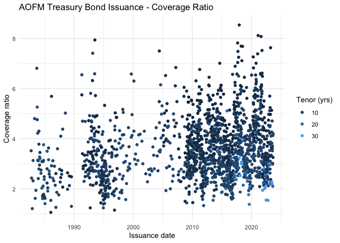

<!-- README.md is generated from README.Rmd. Please edit that file -->

# readAOFM

<!-- badges: start -->
<!-- badges: end -->

The goal of {readAOFM} is to it make easier to download and use data
from the AOFM’s DataHub.

## Installation

You can install the development version of readAOFM from
[GitHub](https://github.com/) with:

``` r
# install.packages("devtools")
devtools::install_github("joel23978/readAOFMpackage")
```

## Example

We can pull data from the AOFM with a single line of code, and a few
more lines to make a chart

``` r
library(tidyr)
library(dplyr)
library(here)
library(httr)
library(readxl)
library(zoo)
library(data.table)
library(janitor)
library(stringr)
library(tibble)
library(ggplot2)

library(readAOFM)

## Treasury Bond Coverage Ratio's
p <- read_aofm("tb", "issuance") %>%
  filter(name == "coverage_ratio") %>%
  ggplot(aes(x = date_held
             , y = value
             , colour = as.numeric(difftime(maturity, date_held))/365
  )) +
  geom_point() +
  theme_minimal() +
  xlab("Issuance date") +
  ylab("Coverage ratio") +
  guides(colour=guide_legend(title="Tenor (yrs)")) +
  ggtitle("AOFM Treasury Bond Issuance - Coverage Ratio")
p
```



What the data looks like:

``` r
print(read_aofm("tb", "issuance"))
```

    #> # A tibble: 23,322 × 7
    #>    date_held  tender_number maturity   isin         date_settled name      value
    #>    <date>     <chr>         <date>     <chr>        <date>       <chr>     <dbl>
    #>  1 1982-09-17 TB2           1992-03-16 AU0000XCLQA2 1982-09-22   coupon   1.5 e1
    #>  2 1982-09-17 TB2           1992-03-16 AU0000XCLQA2 1982-09-22   amount_… 1.5 e8
    #>  3 1982-09-17 TB2           1992-03-16 AU0000XCLQA2 1982-09-22   amount_… 1.5 e8
    #>  4 1982-09-17 TB2           1992-03-16 AU0000XCLQA2 1982-09-22   amount_… 5.22e8
    #>  5 1982-09-17 TB2           1992-03-16 AU0000XCLQA2 1982-09-22   coverag… 3.52e0
    #>  6 1982-09-17 TB2           1992-03-16 AU0000XCLQA2 1982-09-22   weighte… 1.53e1
    #>  7 1982-09-17 TB2           1992-03-16 AU0000XCLQA2 1982-09-22   lowest_… 1.52e1
    #>  8 1982-09-17 TB2           1992-03-16 AU0000XCLQA2 1982-09-22   highest… 1.53e1
    #>  9 1982-09-17 TB2           1992-03-16 AU0000XCLQA2 1982-09-22   highest… 1.63e1
    #> 10 1982-09-17 TB2           1992-03-16 AU0000XCLQA2 1982-09-22   weighte… 1.55e1
    #> # ℹ 23,312 more rows

The read_aofm function takes up to four arguments:

- security, \## options include; tb, tib, tn, slf, summary, aggregate,
  ownership, retail, term.premium
- type, \## options include; dealt, settlement, issuance, syndication,
  buyback, turnover
- csv = FALSE, \## defaults to FALSE, if TRUE it will output a csv to
  /ouput with the cleaned data
- data.index = index, \## an index of data on the AOFM website, pulled
  from index.R

The function needs to be written to an object like the below:

- Where the excel files has multiple sheets the data is written to a
  list object with a list element for each sheet.
- The “Notes” sheet in the orignal files is not read into R

``` r
tb_issuance <- read_aofm("tb", "issuance")
```

<!-- To see the index of files/arguments to pass, use: -->
<!-- ```{r} -->
<!-- browse_tables() -->
<!-- ``` -->

download.R contains two functions:

- download_aofm_xlsx() enables you down a single file (or all data
  files) from the AOFM’s website to a /data subfolder
  - if no argument is passed; it will download all files from the AOFM’s
    webite
  - if an argument with multiple matches is passed it will download all
    matching tables
  - if two arguments are passed (security, type) it will download the
    specific table
- find_file() takes arguments for (security, type) and returns a table
  id

## Disclaimer

The AOFM website may, at any time, change in such a way that the package
stops working (esp if they change the structure of the files).

This package is not affiliated with or endorsed by AOFM, all data is
provided under any terms set out on the AOFM website.
